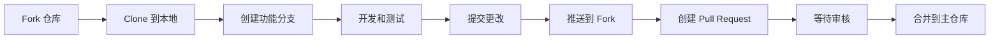

# 贡献指南

感谢你对义务维修队网站的关注！本文档将指导你如何参与项目开发。

## 📋 目录

- [开发环境准备](#开发环境准备)
- [工作流程](#工作流程)
- [代码规范](#代码规范)
- [提交 PR](#提交-pr)
- [常见问题](#常见问题)

## 开发环境准备

### 必需工具

1. **Node.js** (版本 16 或更高)
   - 下载地址: https://nodejs.org/
   - 验证安装: `node --version`

2. **Git**
   - 下载地址: https://git-scm.com/
   - 验证安装: `git --version`

3. **代码编辑器** (推荐 VS Code)
   - 下载地址: https://code.visualstudio.com/
   - 推荐扩展:
     - Vue Language Features (Volar)
     - ESLint
     - Prettier

### 项目设置

```bash
# 1. Fork 仓库到你的 GitHub 账号

# 2. Clone 你的 fork
git clone https://github.com/你的用户名/Friendly-Fix-It-Crew.github.io.git

# 3. 进入项目目录
cd Friendly-Fix-It-Crew.github.io

# 4. 添加上游远程仓库
git remote add upstream https://github.com/Hyron-long/Friendly-Fix-It-Crew.github.io.git

# 5. 安装依赖
npm install

# 6. 启动开发服务器
npm run dev
```

## 工作流程

### 标准开发流程



### 详细步骤

#### 1. 同步最新代码

在开始新功能前，先同步主仓库的最新代码：

```bash
git fetch upstream
git checkout main
git merge upstream/main
git push origin main
```

#### 2. 创建功能分支

为每个新功能或修复创建一个独立的分支：

```bash
git checkout -b feature/功能名称
# 或
git checkout -b fix/问题描述
```

分支命名规范：

- `feature/xxx` - 新功能
- `fix/xxx` - Bug 修复
- `docs/xxx` - 文档更新
- `refactor/xxx` - 代码重构

示例：

```bash
git checkout -b feature/add-contact-form
git checkout -b fix/order-delete-bug
```

#### 3. 开发和测试

```bash
# 启动开发服务器
npm run dev

# 访问 http://localhost:5173 测试

# 构建生产版本检查是否有错误
npm run build
```

#### 4. 提交更改

```bash
# 查看修改的文件
git status

# 添加所有更改
git add .

# 提交（使用规范的 commit 消息）
git commit -m "feat: 添加联系表单功能"

# 推送到你的 fork
git push origin feature/功能名称
```

#### 5. 创建 Pull Request

1. 访问你的 fork 仓库页面
2. 点击 "Compare & pull request" 按钮
3. 填写 PR 信息：
   - **标题**: 简洁描述改动
   - **描述**: 详细说明做了什么、为什么这样做
   - **截图**: 如果有 UI 改动，附上截图
4. 选择合并到主仓库的 `main` 分支
5. 提交 PR

## 代码规范

### Commit 消息规范

使用语义化 commit 消息格式：

```
<type>: <description>

[optional body]

[optional footer]
```

**Type 类型：**

- `feat`: 新功能
- `fix`: Bug 修复
- `docs`: 文档更新
- `style`: 代码格式（不影响功能）
- `refactor`: 代码重构
- `test`: 测试相关
- `chore`: 构建过程或辅助工具变动

**示例：**

```bash
# 新功能
git commit -m "feat: 添加预约表单验证功能"

# Bug 修复
git commit -m "fix: 修复工单删除后列表不刷新的问题"

# 文档更新
git commit -m "docs: 更新README中的安装说明"

# 代码重构
git commit -m "refactor: 优化订单存储逻辑"
```

### Vue 代码规范

#### 1. 组件命名

- 使用 PascalCase: `ServiceCard.vue`, `OrderForm.vue`
- 文件名与组件名保持一致

#### 2. Script Setup

优先使用 `<script setup>` 语法：

```vue
<script setup>
import { ref, computed } from "vue";

const count = ref(0);
const doubleCount = computed(() => count.value * 2);
</script>
```

#### 3. Props 定义

使用 `defineProps` 并指定类型：

```vue
<script setup>
const props = defineProps({
  title: {
    type: String,
    required: true,
  },
  icon: {
    type: String,
    default: "🔧",
  },
});
</script>
```

#### 4. 样式规范

- 使用 scoped CSS
- 遵循 BEM 命名规范
- 使用 CSS 变量

```vue
<style scoped>
.service-card {
  padding: var(--spacing-lg);
  border-radius: var(--radius-md);
}

.service-card__title {
  font-size: 1.2rem;
  color: var(--text-primary);
}
</style>
```

### 文件组织

```
src/
├── components/      # 可复用组件（PascalCase）
├── views/          # 页面组件（PascalCase）
├── stores/         # Pinia stores
├── router/         # 路由配置
├── styles/         # 全局样式
└── assets/         # 静态资源
```

## 提交 PR

### PR 检查清单

在提交 PR 前，请确认：

- [ ] 代码可以正常运行 (`npm run dev`)
- [ ] 构建没有错误 (`npm run build`)
- [ ] 已测试主要功能
- [ ] 遵循代码规范
- [ ] Commit 消息清晰明确
- [ ] 更新了相关文档（如需要）
- [ ] 没有遗留的 console.log

### PR 模板

```markdown
## 改动类型

- [ ] 新功能
- [ ] Bug 修复
- [ ] 文档更新
- [ ] 其他

## 描述

简要描述这次改动的内容和目的

## 相关 Issue

如果有关联的 Issue，请在此提及

## 截图（如适用）

如果有 UI 改动，请附上截图

## 测试步骤

1. ...
2. ...
3. ...

## 额外说明

其他需要说明的内容
```

## 常见问题

### Q: 如何解决合并冲突？

```bash
# 1. 获取上游最新代码
git fetch upstream

# 2. 合并上游 main 分支
git merge upstream/main

# 3. 解决冲突文件中的冲突标记
# <<<<<<< HEAD
# 你的代码
# =======
# 上游的代码
# >>>>>>> upstream/main

# 4. 标记冲突已解决
git add .

# 5. 完成合并
git commit

# 6. 推送
git push origin feature/your-branch
```

### Q: 如何撤销一次 commit？

```bash
# 撤销最后一次 commit（保留更改）
git reset --soft HEAD~1

# 撤销最后一次 commit（丢弃更改）
git reset --hard HEAD~1
```

### Q: 端口被占用怎么办？

Vite 会自动尝试下一个可用端口。如需指定端口：

```javascript
// vite.config.js
export default defineConfig({
  server: {
    port: 3000,
  },
});
```

### Q: 如何清除本地存储的数据？

在浏览器中：

1. 打开开发者工具 (F12)
2. 进入 Application 标签
3. 找到 Local Storage
4. 右键清除

或在控制台执行：

```javascript
localStorage.clear();
```

### Q: 样式修改不生效？

检查以下几点：

1. 是否使用了 `<style scoped>`
2. 选择器是否正确
3. 是否需要使用 `!important`（尽量避免）
4. 清除浏览器缓存

## 获取帮助

- 📖 阅读 [Vue 3 官方文档](https://cn.vuejs.org/)
- 📖 阅读 [Vite 官方文档](https://cn.vite.dev/)
- 💬 在团队群组中提问
- 🐛 通过 GitHub Issues 反馈问题

## 致谢

感谢每一位为项目做出贡献的同学！你们的努力让这个项目变得更好。❤️

---

**让我们一起打造更好的义务维修队网站！** 🚀
